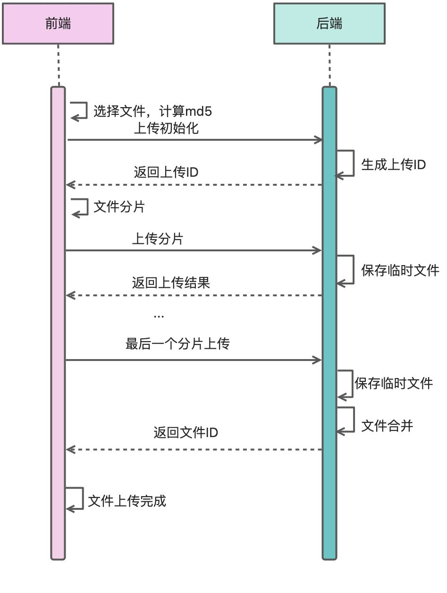
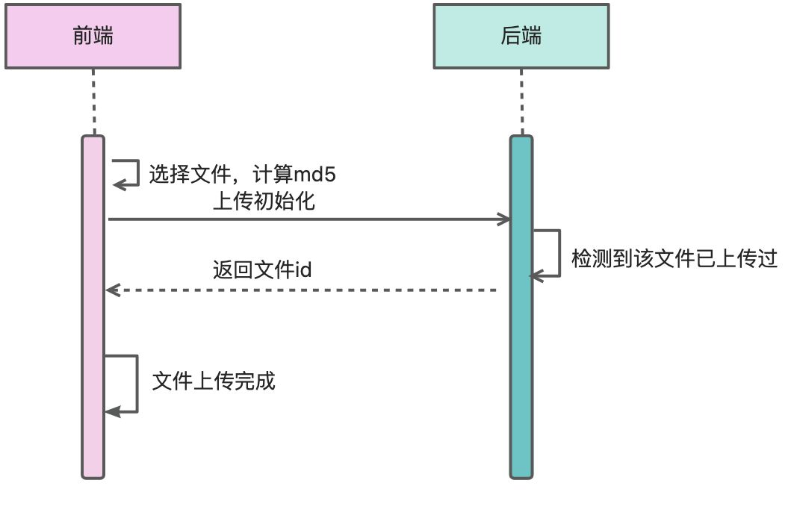
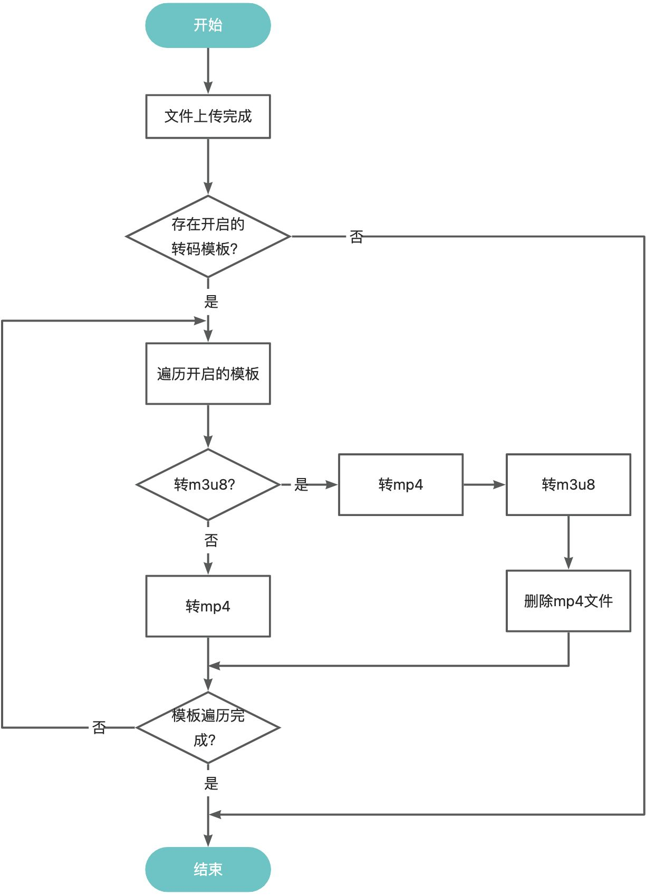

<h1 align="center">
 凌夕文件管理系统
</h1>
<p align="center">
 
 
 
</p>

凌夕文件管理系统是基于SpringBoot3.x+Mybatis+Mybatis-Plus+VUE3+Element Plus开发的文件管理系统，
支持单文件上传、分片上传，视频上传完成后，可以根据视频转码配置转成对应的视频格式（mp4、m3u8），文档上传完成后，会转成pdf文件，
支持word、excel、ppt、wps、text、rtf文件转成pdf。

支持音视频、图片、文档在线预览、下载、重命名、移动文件夹、删除等操作，支持文件分类查看。

交流QQ群(129491838)：[](http://qm.qq.com/cgi-bin/qm/qr?_wv=1027&k=FdpjCOVAHrVOFKMrldtY5634Yv_xlyfp&authKey=JAauXhwZMTNhJ%2BB1DDDa%2Bbd9mSkyNYTjeE07GMUOIOQ8CSYrkQ%2FoVfUQU9n%2Frhrp&noverify=0&group_code=129491838)

前端git地址[]()：[https://gitee.com/lxinet/lfs-vue](https://gitee.com/lxinet/lfs-vue)

# 在线文档

在线文档地址[]()：[https://lfs.lxinet.cn](https://lfs.lxinet.cn)


# 环境支持

java环境：jdk17+

数据库：mysql 8.0

缓存：redis

文件服务器：nginx

部署前需修改application.yml文件中的mysql和redis信息，需要部署nginx服务作为文件服务器，nginx配置可查看“本地存储”章节内容

# 开发框架
## 后端
springboot3.x+mybatis+mybatis-plus

## 前端
vue3+element-plus+vite

# 系统功能
## 后端


# 系统配置
## 文件大小限制
默认支持2G文件上传，如果需要调整，修改application.yml中的以下2个参数：
```yaml
spring:
  servlet:
    multipart:
      #单个文件最大限制
      max-file-size: 2048MB
      #总上传文件总大小
      max-request-size: 2048MB
```
## 视频水印
视频水印只支持图片水印，要开启视频水印，需要先将视频水印图片放在项目目录下。

水印文件固定路径：/resources/static/watermark.png

可以开启、关闭水印，可以设置水印位置，具体可以看以下水印的配置信息。
```yaml
config:
  video:
    #视频水印，水印图片固定在位置：/resources/static/watermark.png
    watermark:
      #开启/关闭水印，true 开启，false 关闭
      enable: true
      #水印位置 TOP_LEFT 左上角，TOP_RIGHT 右上角，BOTTOM_LEFT 左下角，BOTTOM_RIGHT 右下角
      location: TOP_LEFT
      #x、y为对应4个角的距离，不能为负数，负数可能会报错
      offset-x: 100
      offset-y: 100
```
## 文档水印
文档水印只有在转成pdf后才可以添加水印，文档只能添加文字水印，可以配置当前时间。

可以开启、关闭水印，可以设置水印位置，具体可以看以下水印的配置信息。
```yaml
config:
  document:
    watermark:
      #开启/关闭水印，true 开启，false 关闭
      enable: true
      #开启水印加上当前时间
      time-enable: true
      #时间格式，yyyy 年、MM 月、dd 日、HH 小时、mm 分钟、ss 秒
      time-format: yyyy-MM-dd HH:mm:ss
      #水印内容，如果开启时间，会在内容后面加上时间
      content: 凌夕文件管理系统
      #文字大小
      font-size: 12
      #行距
      row-space: 100
      #列距
      col-space: 150
      #透明度
      alpha: 0.1
```
## 文件存储
文件存储支持本地文件存储和minio存储（还未完善，如果有需要，可以继续完善该功能），在application.yml中可以设置存储类型
```yaml
config:
  file-server:
    #文件服务，local/minio，local本地文件服务，minio minio服务
    type: local
```
### 本地存储
#### 存储目录和访问配置
本地存储需要配置本地存储文件路径（绝对路径）和本地文件预览地址，需要使用nginx配置file-dir的访问服务，preview-url为nginx配置的域名和端口。
```yaml
config:
  file-server:
    local:
      #本地文件上传路径
      file-dir: /Users/zcx/develop/lfs/uploadFile
      #本地文件预览地址
      preview-url: http://127.0.0.1:8918
```
#### nginx配置
```nginx
server {
  listen       8918;
  server_name  localhost;

  location ~ .*\.ts {
    root   /Users/zcx/develop/lfs/uploadFile;
  }

  location ~ .*/thum/.* {
    root   /Users/zcx/develop/lfs/uploadFile;
  }

  location / {
    root   /Users/zcx/develop/lfs/uploadFile;
    index  index.html index.htm;
    
	add_header Access-Control-Allow-Origin *;
	add_header Access-Control-Allow-Methods 'GET, POST, OPTIONS';

	if ($request_method = 'OPTIONS') {
	    return 204;
	}
	
    if ($arg_oper = "down") {
      add_header Content-Disposition "attachment;filename=$arg_filename";
    }

    secure_link $arg_secret,$arg_expire;
    secure_link_md5 e9eaa184ac1b4068829edb4f3ea978f4$uri$arg_expire;
    if ($secure_link = "") {
      return 403;
    }
    if ($secure_link = "0") {
      return 403;
    }
  }
}
```
#### 防盗链配置
防盗链需要配置密钥和有效期时间，需要nginx配置配合，nginx配置可以查看上节nginx配置，配置的密钥需要和nginx中的密钥一致。
```yaml
config:
  file-server:
    local:
      #密钥
      secret: e9eaa184ac1b4068829edb4f3ea978f4
      # 防盗链st有效时长（秒）
      st-effective-time: 86400
```
### minio存储（未完善）
需要配置minio服务相关信息，如下：
```yaml
config:
  file-server:
    minio:
      access-key: HgiCBQslp8LDfNyWuTOj
      secret-key: 65Quqe4SR881xrs9je9A4vjRNtoWmkYvtT78mL9b
      url: http://127.0.0.1:9000
      bucket-name: test
```
# 文件上传
目前未限制文件上传格式，如果有需要，可以增加限制。

每个上传ID只能上传一个文件，如果上传多个文件用同一个上传ID，会导致上传失败。
## 本地文件存储

- 原文件：{config.file-server.local.file-dir}/files/{uuid+后缀}

如：/Users/zcx/develop/lfs/uploadFile/files/0cc01a75-399a-446c-8b26-902e95178856.mp4

- 视频转码文件：{config.file-server.local.file-dir}/trans/video/{uuid+后缀}

如：/Users/zcx/develop/lfs/uploadFile/trans/video/8ab4b994-a4a8-42f6-8b1d-55e6abbb123c.mp4

- 文档转码文件：{config.file-server.local.file-dir}/trans/document/{uuid+后缀}

如：/Users/zcx/develop/lfs/uploadFile/trans/document/8ab4b994-a4a8-42f6-8b1d-55e6abbb123c.mp4

- 视频hls文件：

{config.file-server.local.file-dir}/trans/hls/uuid/video.m3u8

{config.file-server.local.file-dir}/trans/hls/uuid/video_{分片编号}.ts

如：/Users/zcx/develop/lfs/uploadFile/trans/hls/65498aa0-5b0e-4959-9127-fc1f57cc98d4/video.m3u8

/Users/zcx/develop/lfs/uploadFile/trans/hls/65498aa0-5b0e-4959-9127-fc1f57cc98d4/video_0.ts
> 注：一个视频hls文件会有m3u8和ts两种文件格式，m3u8文件一个，ts文件若干个，每个ts文件有10秒视频，ts文件编号从0开始

- 视频封面文件：{config.file-server.local.file-dir}/thum/原文件md5值/截取图片所在秒数.jpg

如：/Users/zcx/develop/lfs/uploadFile/thum/db94fba515e9c0dc7cb20dbf06bc410c/1.jpg
## 文件分片上传流程
### 正常流程



### 秒传



# 转码配置
## 模板名称
设置模板名称 name
## 视频
### 分辨率
分辨率可以设置宽和高，宽和高至少设置1个，另一个可以设置，也可以设置为0，如果设置为0，自动根据原视频宽高计算。

分辨率设置的是PAR（图像纵横比），默认未指定sar或者dar时，dar不会变，sar会被设置为跟par比例一样，所以转码的视频比例也不会变，宽度根据高度自动计算，即指定的宽度无效。

- PAR图像纵横比：PAR=（每行像素数）/（每列像素数）=分辨率
- SAR样点纵横比：SAR=（像素的宽）/（像素的高）。像素不一定都是正方形的。
- DAR显示纵横比：一般说的16:9和4:3指的是DAR。DAR=（每行像素数像素的宽）/（每列像素数像素的高），即DAR=PAR*SAR

480p=标清=640x480

720p=高清=1280×720p

1080p=蓝光=1920x1080p

2K=1440P=2560x1440

4K=2160P=3840x2160

8K=4320P= 7680×4320

高度默认：1080

宽度默认：0（自动计算）
### 转码格式

- 选项：mp4、m3u8
- 默认：mp4
### 视频帧率
视频帧率是用于测量显示帧数的量度。所谓的测量单位为每秒显示帧数(Frames per Second,简:FPS)或"赫兹"(Hz)

- 选项：15、20、25、30、40、50、60
- 默认：30
### 视频比特率（码率 kbps）
通常也叫码率是指单位时间内传送的比特(bit)数，单位为bps(bit per second）

- 选项：500、800、1200、2000、3000、5000、8000
- 默认：1200
### 编解码器
H264通常也被称之为H264/AVC（或者H.264/MPEG-4 AVC或MPEG-4/H.264 AVC），H264有高效的视频压缩算法来压缩视频的占用空间，提高存储和传输的效率，在获得有效的压缩效果的同时，使得压缩过程引起的失真最小。H264是目前较为主流的编码标准。

- 选项：h264
- 默认：h264
### 封面截图
每个md5的视频文件，会截取10张封面用来选择，截图规则是分别取第1、3、5、7秒、视频时长/2秒、视频时长/2 + 2秒、倒数第7、5、3、1秒的画面。

截图格式为jpg图片。
## 音频
### 编解码器
目前音频基本都用AAC编码，因为这个编码目前来说压缩率高，而且音质损失极底。

- 选项：aac
- 默认：aac
### 声道
单声道：是指一个声音的通道，把来自不同方位的音频信号混合后统一由录音器材把它记录下来，再由一个扬声器进行重放（没有左右声道之分）。早期的收音机都是单声道的，耳机就一个耳朵。

双声道：是指有两个声音的通道，双声道是在空间放置两个互成一定角度的扬声器，每个扬声器单独由一个声道提供信号。双声道是二路输入，二路输出，但不一定是立体声。（左右声道都只有一路的信号输入），也称为双声道混和声。

- 选项：1、2
- 默认：2
### 音频码率（音频比特率）
一般普通音质码率大致在80~164kbps左右，HQ高音质192~320kbps左右，SQ无损800~1500kbps左右，CD及其它无压缩音质数值过万甚至更高。

普通音质转成无损音质，并不是成了无损音乐，反而体积增大了，这就是所谓假无损。

- 选项：16、32、48、64、80、96、112、128、160、192、224、256、320、384、448、512
- 默认：128
### 音频采样率
音频采样率是指录音设备在一秒钟内对声音信号的采样次数，它决定了数字音频信号的分辨率。采样率的单位通常是赫兹（Hz）。采样率越高，理论上能够捕捉到的声音细节越多，从而产生的声音质量也更高。

- 选项：8000、11025、12000、16000、22050、24000、32000、44100、48000、64000、88200、96000
- 默认：48000
- 部分说明：

8000 Hz：电话所用采样率, 对于人的说话已经足够

11025 Hz：电话所用采样率

22050 Hz：无线电广播所用采样率

32000 Hz：miniDV 数码视频 camcoRDer、DAT (LP mode)所用采样率

44100 Hz：音频 CD, 也常用于 MPEG-1 音频（VCD, SVCD, MP3）所用采样率

48000 Hz：miniDV、数字电视、DVD、DAT、电影和专业音频所用的数字声音所用采样率

96000 Hz：DVD-Audio、一些 LPCM DVD 音轨、BD-ROM（蓝光盘）音轨、和 HD-DVD （高清晰度 DVD）音轨所用所用采样率

# 转码
## 转码流程

